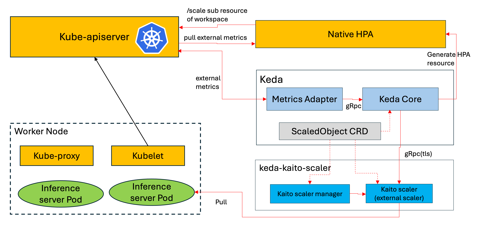

# KEDA Kaito Scaler

A specialized KEDA external scaler for automatically scaling GPU inference workloads in [Kaito](https://github.com/kaito-project/kaito) without requiring external dependencies like Prometheus.

## Overview

The KEDA Kaito Scaler provides intelligent autoscaling for vLLM inference workloads by directly collecting metrics from inference pods. It offers a simplified, user-friendly alternative to complex Prometheus-based scaling solutions while maintaining the same powerful scaling capabilities.

### Key Features

- **🚀 Zero Dependencies**: No Prometheus stack required - directly scrapes metrics from inference pods
- **⚡ Simple Configuration**: Minimal YAML configuration with intelligent defaults
- **🎯 GPU-Optimized**: Conservative scaling policies designed for expensive GPU resources
- **🔒 Secure by Default**: Built-in TLS authentication between components
- **📊 Smart Fallback**: Intelligent handling of missing metrics to prevent scaling flapping
- **🔧 Minimal Maintenance**: Self-managing certificates and authentication

## Architecture



## Quick Start

### Prerequisites
## Enable InferenceSet Controller during KAITO install

To support autoscaling of KAITO GPU inference workloads, `InferenceSet` custom resource should be used in KAITO and the InferenceSet Controller must be enabled during the KAITO installation. The `InferenceSet` was introduced as an alpha feature in KAITO `v0.8.0`.

```bash
export CLUSTER_NAME=kaito

helm repo add kaito https://kaito-project.github.io/kaito/charts/kaito
helm repo update
helm upgrade --install kaito-workspace kaito/workspace \
  --namespace kaito-workspace \
  --create-namespace \
  --set clusterName="$CLUSTER_NAME" \
  --set featureGates.enableInferenceSetController=true \
  --wait
```

- install KEDA
> the following example demonstrates how to install KEDA using Helm chart. For instructions on installing KEDA through other methods, please refer to the guide [here](https://github.com/kedacore/keda#deploying-keda).
```bash
helm repo add kedacore https://kedacore.github.io/charts
helm install keda kedacore/keda --namespace keda --create-namespace
```

### Deploy KEDA Kaito Scaler
> autoscaling of KAITO GPU inference workloads requires KEDA Kaito Scaler version v0.3.3 or higher.

```bash
helm repo add keda-kaito-scaler https://kaito-project.github.io/keda-kaito-scaler/charts/kaito-project
helm upgrade --install keda-kaito-scaler -n kaito-workspace keda-kaito-scaler/keda-kaito-scaler --create-namespace
```

### Create a Kaito InferenceSet for running inference workloads
 - The following example creates an InferenceSet for the phi-4-mini model, using annotations with the prefix `scaledobject.kaito.sh/` to supply parameter inputs for the KEDA Kaito Scaler:
   - `scaledobject.kaito.sh/auto-provision`
     - indicates whether KEDA Kaito Scaler will automatically provision a ScaledObject based on the `InferenceSet` object
   - `scaledobject.kaito.sh/max-replicas`
     - specifies the maximum number of replicas for the `InferenceSet` during autoscaling.
   - `scaledobject.kaito.sh/metricName`
     - specifies the metric name collected from the vLLM pod, which is used for monitoring and triggering the scaling operation, default is `vllm:num_requests_waiting`
   - `scaledobject.kaito.sh/threshold`
     - specifies the threshold for the monitored metric that triggers the scaling operation

```bash
cat <<EOF | kubectl apply -f -
apiVersion: kaito.sh/v1alpha1
kind: InferenceSet
metadata:
  annotations:
    scaledobject.kaito.sh/auto-provision: "true"
    scaledobject.kaito.sh/max-replicas: "5"
    scaledobject.kaito.sh/metricName: "vllm:num_requests_waiting"
    scaledobject.kaito.sh/threshold: "10"
  name: phi-4
  namespace: default
spec:
  labelSelector:
    matchLabels:
      apps: phi-4
  replicas: 1
  template:
    inference:
      preset:
        accessMode: public
        name: phi-4-mini-instruct
    resource:
      instanceType: Standard_NC24ads_A100_v4
EOF
```

That's it! Your Kaito workloads will now automatically scale based on the number of waiting inference request(`vllm:num_requests_waiting`).

## License

This project is licensed under the Apache 2.0 License - see the [LICENSE](LICENSE) file for details.

## Related Projects

- [Kaito](https://github.com/kaito-project/kaito) - Kubernetes AI Toolchain Operator
- [KEDA](https://github.com/kedacore/keda) - Kubernetes Event-driven Autoscaling
- [vLLM](https://github.com/vllm-project/vllm) - Fast and easy-to-use library for LLM inference
