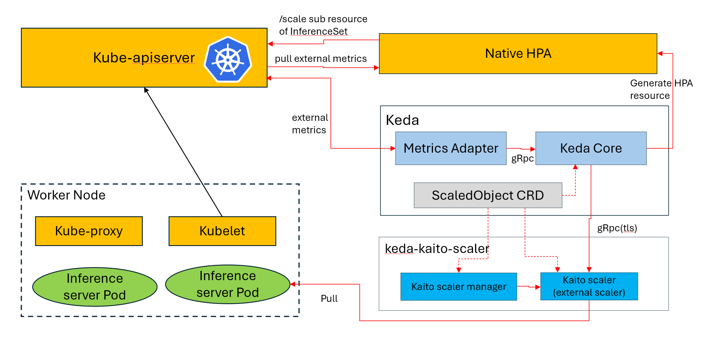

# KEDA Kaito Scaler

A dedicated KEDA external scaler designed to automatically scale GPU inference workloads in [Kaito](https://github.com/kaito-project/kaito), eliminating the need for external dependencies such as Prometheus.

## Overview

The KEDA Kaito Scaler provides intelligent autoscaling for vLLM inference workloads by directly collecting metrics from inference pods. It offers a simplified, user-friendly alternative to complex Prometheus-based scaling solutions while maintaining the same powerful scaling capabilities.

### Key Features

- **🚀 Zero Dependencies**: No Prometheus stack required - directly scrapes metrics from inference pods
- **⚡ Simple Configuration**: Minimal YAML configuration with intelligent defaults
- **🎯 GPU-Optimized**: Conservative scaling policies designed for expensive GPU resources
- **🔒 Secure by Default**: Built-in TLS authentication between components
- **📊 Smart Fallback**: Intelligent handling of missing metrics to prevent scaling flapping
- **🔧 Minimal Maintenance**: Self-managing certificates and authentication

## Architecture



## Prerequisites
### Enable InferenceSet Controller during KAITO install

To enable autoscaling of KAITO GPU inference workloads, the `InferenceSet` custom resource must be utilized in KAITO, and the InferenceSet Controller should be activated during the KAITO installation. The `InferenceSet` feature was introduced in KAITO version `v0.8.0` as an alpha feature.

```bash
export CLUSTER_NAME=kaito

helm repo add kaito https://kaito-project.github.io/kaito/charts/kaito
helm repo update
helm upgrade --install kaito-workspace kaito/workspace \
  --namespace kaito-workspace \
  --create-namespace \
  --set clusterName="$CLUSTER_NAME" \
  --set featureGates.enableInferenceSetController=true \
  --wait
```

### install KEDA
> the following example demonstrates how to install KEDA using Helm chart. For instructions on installing KEDA through other methods, please refer to the guide [here](https://github.com/kedacore/keda#deploying-keda).
```bash
helm repo add kedacore https://kedacore.github.io/charts
helm install keda kedacore/keda --namespace keda --create-namespace
```

## Quick Start
### Deploy KEDA Kaito Scaler
> autoscaling of KAITO GPU inference workloads requires KEDA Kaito Scaler version v0.3.3 or higher.

```bash
helm repo add keda-kaito-scaler https://kaito-project.github.io/keda-kaito-scaler/charts/kaito-project
helm repo update
```

Check available versions:
```bash
helm search repo -l keda-kaito-scaler
```
```
NAME                                    CHART VERSION   APP VERSION   DESCRIPTION
keda-kaito-scaler/keda-kaito-scaler     0.3.3           v0.3.3        A Helm chart for Kaito keda-kaito-scaler compon...
keda-kaito-scaler/keda-kaito-scaler     0.3.0           v0.3.0        A Helm chart for Kaito keda-kaito-scaler compon...
keda-kaito-scaler/keda-kaito-scaler     0.2.0           v0.2.0        A Helm chart for Kaito keda-kaito-scaler compon...
keda-kaito-scaler/keda-kaito-scaler     0.0.1           v0.0.1        A Helm chart for Kaito keda-kaito-scaler compon...
```

```bash
helm upgrade --install keda-kaito-scaler -n keda keda-kaito-scaler/keda-kaito-scaler
```

> **keda-kaito-scaler must be installed in the same namespace as KEDA**
> (`keda` in the command above). The chart's `ClusterTriggerAuthentication`
> references TLS secrets created in the scaler's namespace, and KEDA only
> resolves those secrets when it can read them from its own namespace.

### Create a Kaito InferenceSet for running inference workloads

You can drive autoscaling in two ways:

1. **Auto-provision mode (recommended)** — annotate the `InferenceSet` and let
   keda-kaito-scaler create and reconcile the `ScaledObject` for you.
2. **Manual mode** — author the `ScaledObject` yourself and point its `external`
   trigger at the keda-kaito-scaler service.

Both modes share the same scaling semantics:

- The trigger uses HPA `metricType: AverageValue`. The scaler returns the
  **sum** of the metric across all `Workspace` services owned by the
  `InferenceSet`, and `threshold` is the **per-replica** target (HPA computes
  `desiredReplicas = ceil(sum / threshold)`).
- Per-service scrape failures are compensated only on the scale-down path
  (missing samples are treated as `threshold`), preventing flapping when a
  single replica is briefly unreachable.
- The default scraped metric is `vllm:num_requests_waiting`. Any Prometheus
  metric exposed on the workspace `Service` works (use a metric family name
  identical to what `/metrics` exposes).

#### Option 1: Auto-provision via InferenceSet annotations

Annotations under the `scaledobject.kaito.sh/` prefix configure the auto-provision
controller. When `auto-provision=true` and the configuration is valid, the
controller creates a `ScaledObject` named after the `InferenceSet` (and keeps
it in sync on annotation updates).

| Annotation | Required | Default | Description |
|---|---|---|---|
| `scaledobject.kaito.sh/auto-provision` | yes | – | Must be `"true"` to enable auto-provisioning. |
| `scaledobject.kaito.sh/threshold` | yes | – | Per-replica target value passed to the trigger. Non-negative integer. |
| `scaledobject.kaito.sh/metricName` | no | `vllm:num_requests_waiting` | Prometheus metric family name to scrape from each pod. |
| `scaledobject.kaito.sh/min-replicas` | no | `1` | Minimum replica count. Values `<= 1` collapse to `1`. |
| `scaledobject.kaito.sh/max-replicas` | no | derived from `spec.nodeCountLimit` | Maximum replica count. When set, must be `> 1` and `>= min-replicas`; otherwise the controller skips reconciling and emits an `InvalidReplicaRange` warning event. If absent, auto-provisioning requires `spec.nodeCountLimit` to be set. |

```bash
cat <<EOF | kubectl apply -f -
apiVersion: kaito.sh/v1alpha1
kind: InferenceSet
metadata:
  annotations:
    scaledobject.kaito.sh/auto-provision: "true"
    scaledobject.kaito.sh/metricName: "vllm:num_requests_waiting"
    scaledobject.kaito.sh/threshold: "10"
  name: phi-4
  namespace: default
spec:
  labelSelector:
    matchLabels:
      apps: phi-4
  replicas: 1
  nodeCountLimit: 5
  template:
    inference:
      preset:
        accessMode: public
        name: phi-4-mini-instruct
    resource:
      instanceType: Standard_NC24ads_A100_v4
EOF
```

In a few seconds the auto-provision controller creates a managed `ScaledObject`,
and KEDA in turn creates the HPA. Once the inference pods are up and serving
metrics, both objects flip to `READY=True`:

```bash
# kubectl get scaledobject
NAME    SCALETARGETKIND                  SCALETARGETNAME   MIN   MAX   READY   ACTIVE   FALLBACK   PAUSED   TRIGGERS   AUTHENTICATIONS           AGE
phi-4   kaito.sh/v1alpha1.InferenceSet   phi-4             1     5     True    True     False      False    external   keda-kaito-scaler-creds   10m

# kubectl get hpa
NAME             REFERENCE            TARGETS      MINPODS   MAXPODS   REPLICAS   AGE
keda-hpa-phi-4   InferenceSet/phi-4   0/10 (avg)   1         5         1          11m
```

#### Option 2: Manage the ScaledObject yourself

If you prefer to author the `ScaledObject` directly (e.g. to plug in custom
scaling policies or additional triggers), point an `external` trigger at the
keda-kaito-scaler service and reuse the chart-installed
`ClusterTriggerAuthentication` for mTLS.

```yaml
apiVersion: keda.sh/v1alpha1
kind: ScaledObject
metadata:
  name: phi-4
  namespace: default
spec:
  scaleTargetRef:
    apiVersion: kaito.sh/v1alpha1
    kind: InferenceSet
    name: phi-4
  minReplicaCount: 1
  maxReplicaCount: 5
  triggers:
    - type: external
      name: keda-kaito-scaler
      metricType: AverageValue
      authenticationRef:
        kind: ClusterTriggerAuthentication
        name: keda-kaito-scaler-creds
      metadata:
        # Required
        scalerAddress: "keda-kaito-scaler-svc.keda.svc.cluster.local:10450"
        inferenceSetName: phi-4
        inferenceSetNamespace: default
        metricName: "vllm:num_requests_waiting"
        threshold: "10"

        # Optional — defaults shown below match Kaito's current vLLM exposure
        # (Workspace ClusterIP Service on port 80, plain HTTP). Override only
        # if you have customized the inference server.
        # metricProtocol: "http"     # http | https
        # metricPort: "80"
        # metricPath: "/metrics"
        # scrapeTimeout: "3s"
```

The trigger metadata fields map 1:1 to the scaler's gRPC payload:

| Field | Required | Default | Notes |
|---|---|---|---|
| `scalerAddress` | yes | – | Used by KEDA to dial the scaler. Format: `keda-kaito-scaler-svc.<scaler-namespace>.svc.cluster.local:10450`. |
| `inferenceSetName` | yes | – | Target `InferenceSet` name. |
| `inferenceSetNamespace` | yes | – | Target `InferenceSet` namespace. May differ from the `ScaledObject` namespace; a single keda-kaito-scaler instance serves all namespaces in the cluster. |
| `metricName` | yes | – | Prometheus metric family name exposed by each workspace pod. |
| `threshold` | yes | – | Per-replica target (float). HPA: `desired = ceil(sum / threshold)`. |
| `metricProtocol` | no | `http` | `http` or `https`. |
| `metricPort` | no | `80` | Workspace `Service` port. |
| `metricPath` | no | `/metrics` | HTTP path of the Prometheus endpoint. |
| `scrapeTimeout` | no | `3s` | Per-service scrape timeout (Go duration). |

> **metricType must be `AverageValue`.** The scaler returns the cluster-wide
> sum of the metric, so HPA divides by `threshold` (per-replica target) to get
> the desired replica count. Using `Value` would couple desired replicas to the
> current replica count and break scale-from/to-1 transitions.

That's it! Your KAITO workloads will now automatically scale based on the
configured metric (default: `vllm:num_requests_waiting`).

## Release Process

Releases are driven by two manual GitHub Actions workflows. A release produces a multi-arch container image (`ghcr.io/kaito-project/keda-kaito-scaler:<X.Y.Z>`), a Helm chart (`https://kaito-project.github.io/keda-kaito-scaler/charts/kaito-project`), and a GitHub Release with binaries and changelog.

To publish `vX.Y.Z`:

1. Open a PR against `main` that bumps the version in:
   - [`charts/keda-kaito-scaler/Chart.yaml`](charts/keda-kaito-scaler/Chart.yaml) — `version` and `appVersion`
   - [`charts/keda-kaito-scaler/values.yaml`](charts/keda-kaito-scaler/values.yaml) — `image.tag`
   - [`Makefile`](Makefile) — `VERSION ?=` (optional, keeps local-build default aligned)

2. After the PR is merged, run **Actions → "Publish Keda-Kaito-Scaler image(manually)"** with `release_version=vX.Y.Z`. This creates the Git tag, pushes the image, and auto-publishes the Helm chart to `gh-pages`.

3. Run **Actions → "Create release(manually)"** with the same `release_version`. This runs GoReleaser against the tag and publishes the GitHub Release.

Notes:

- Use the same `vX.Y.Z` value for both workflows. Git tags / Release names are prefixed with `v`; image tags are not (`0.3.0`).
- Step 2 must finish before Step 3 (Step 3 checks out the tag created by Step 2).
- The image workflow runs in the `preset-env` environment and may require approval.
- Release branches are not needed for normal releases. Only cut a `release-vX.Y` branch (e.g. `release-v0.3`) when `main` has moved on to the next minor and you still need to ship patch releases for the older line; then run the publish workflows against that branch.

## License

This project is licensed under the Apache 2.0 License - see the [LICENSE](LICENSE) file for details.

## Related Projects

- [Kaito](https://github.com/kaito-project/kaito) - Kubernetes AI Toolchain Operator
- [KEDA](https://github.com/kedacore/keda) - Kubernetes Event-driven Autoscaling
- [vLLM](https://github.com/vllm-project/vllm) - Fast and easy-to-use library for LLM inference
